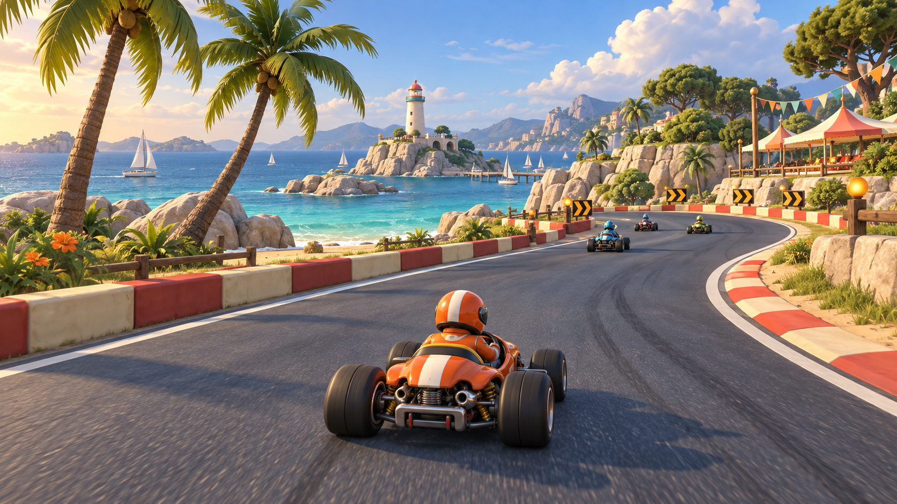
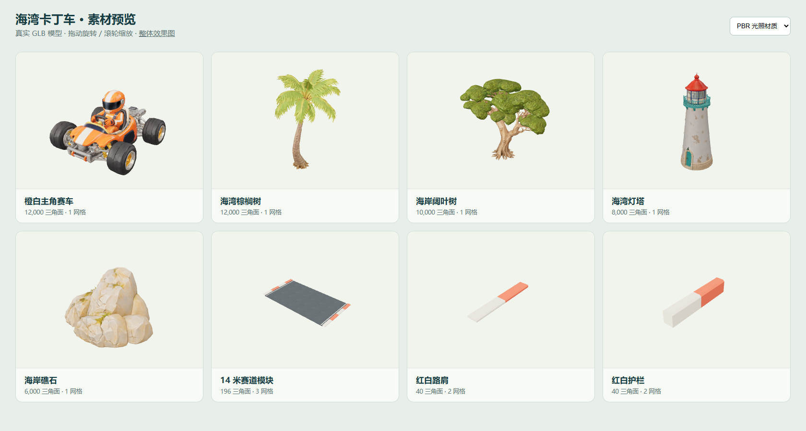

# 咔叮唓赛车素材库

`carding-car` 的独立美术源文件仓库，可用于其他项目。采用海湾赛道、橙白赛车、自然海岸植物和灯塔的统一方向。当前交付是**素材准备**，效果图代表美术目标，未把它描述为 Cocos 游戏实机效果。

扩展素材统一保存在 [`expansion/`](expansion/README.md)：7 个场景、10 种车型、10 种车手、12 种道具，共 39 个静态 GLB，附效果图、贴图、实际模型预览和生成记录。打开 [扩展素材预览](expansion/index.html) 浏览；运行 `python expansion/check-assets.py --complete` 校验。这些源素材尚未加入 `runtime/`，不会随游戏构建整体打包。



## 文件

| 资源 | 内容 | 使用方式 |
| --- | --- | --- |
| `concept.png` | 整体效果图 | 场景构图、色彩与光影目标 |
| `kart/` | 橙白赛车与车手 | Hyper3D GLB，原始单网格；车轮尚未独立拆分 |
| `palm/` | 棕榈树 | 独立环境模型与参考图 |
| `broadleaf/` | 海岸阔叶树 | 独立环境模型与参考图 |
| `lighthouse/` | 灯塔 | 远中景地标与参考图 |
| `coastal-rocks/` | 海岸礁石 | 场景装饰与参考图 |
| `road/road-straight-14x8.glb` | 14 米宽、8 米长路面 | 含边线及两侧路肩，总宽 15.2 米 |
| `road/kerb-4m.glb` | 4 米红白路肩 | 宽 0.6 米、高 0.14 米 |
| `road/barrier-4m.glb` | 4 米红白护栏 | 宽 0.6 米、高 0.75 米 |
| `asphalt-basecolor.png` | 沥青基础色贴图 | 原始 1254 × 1254；导入时设置 Repeat，建议约 2 米一重复 |
| `kart-reference.png` | 赛车独立参考图 | 图生 3D 输入 |
| `manifest.json` | 生成记录 | 提示词、任务 ID、永久结果页、文件对应关系 |
| `validation.json` | 文件验收数据 | SHA-256、实际三角面数、包围盒、贴图尺寸 |
| `preview.html` | 可旋转的真实模型预览 | 可切换 PBR / 预着色源材质 |

每类 Hyper3D 模型有两个版本：`base_basic_pbr.glb` 含基础色、法线、金属度/粗糙度贴图；`base_basic_shaded.glb` 含预着色贴图。GLB 内嵌贴图，适合独立复制或导入；PBR 和 Shaded 二选一进入运行包，不要同时打包。完整源文件保留 2048 × 2048 贴图。

以下为实际 GLB 的渲染预览，区别于上方的整体效果图：



## 预览与检查

在本仓库目录运行：

```sh
python -m http.server 4231 --bind 127.0.0.1
# 浏览器打开 http://127.0.0.1:4231/preview.html
python check-assets.py
```

预览页通过 CDN 使用固定版本 Three.js 0.180.0，需要网络。它只用于素材检查，不替代游戏的 Cocos 引擎。`preview-pbr.png`、`preview-shaded.png` 是实际 GLB 渲染，`preview-validation.json` 记录加载结果。

道路由 Python 标准库生成，不依赖 Blender 或建模插件：

```sh
python build-road.py
python check-assets.py
```

尺寸单位为米，Y 向上、Z 沿道路，路面中心位于原点，路面高度 Y=0。路肩和护栏以底面中心为原点。模块端面可沿 Z 精确拼接；弯道继续使用游戏现有样条网格，将本库贴图和路肩风格应用到曲线，避免用直道模块硬拼连续弯道。贴图边缘和真实手机上的远景重复感仍应在最终赛道中验收。

## Cocos 使用约定

`runtime/` 是已导出的手机用版本，使用预着色材质、512/1024 像素 JPEG、Y=0 落地点与米制尺寸。赛车外轮廓宽 2.16 米、长 2.9 米；其他尺寸见 `runtime/manifest.json`。原始 GLB 保留不变。重新导出运行 `python build-mobile.py`（需要 Pillow），脚本同时检查地面原点和整包 5 MiB 上限。

`runtime/road-profiles.json` 从原始路肩/护栏 GLB 提取几何，供曲线赛道按共享碰撞边界缩放、合批；实际道路使用 `runtime/asphalt.jpg`。生成后的运行文件可直接被其他项目取用，无需 Python。

- Cocos Creator 3.8 支持 GLB/glTF 导入，生成网格、材质与 Prefab；无需更换引擎。参见 [Cocos 模型资源文档](https://docs.cocos.com/creator/3.8/manual/zh/asset/model/mesh.html)。
- Hyper3D 原始模型坐标是归一化空间，不是实际米制尺寸。先根据 `validation.json` 的包围盒设统一比例和落地点，再校准赛车前向为游戏的 +Z。建议赛车总长约 2.7 米、棕榈树高 6 米、阔叶树高 5 米、灯塔高 10 米、礁石宽 4 米。
- 赛车目前是车身、车轮和驾驶员合并的静态视觉网格，没有骨骼或动画。若需要车轮转动/转向，应先拆分网格并校准各轮轴心，不能把现有文件当作已绑定车辆。
- 现有游戏将赛车材质转为 `builtin-unlit`。要使用 PBR 版本，应保留对应法线/金属度/粗糙度和光照；低成本预着色路径则正确映射 Shaded 贴图。只替换文件不会自动达到概念图光影。
- 重复树木应共享网格与材质，按实测需求做 LOD、实例化/批处理和贴图降采样。这里保留原始高质量文件，不宣称已满足小游戏下载包或真机帧率预算。
- 视觉模型与碰撞体分开；道路、护栏仍遵循现有 `TrackBarriers` 的共享几何，避免更换模型后视觉边缘与碰撞边界不一致。
- 本库只放素材与制作记录。由项目导入/构建步骤选取运行资源，源图、双版本模型和验收图不整体进入游戏包。

## 独立复用

```sh
git clone https://github.com/coffeeeeffoc/carding-car-assets.git
# 或在另一项目中作为子模块
git submodule add https://github.com/coffeeeeffoc/carding-car-assets.git assets/carding-car
```

在 small-games 中，这个仓库位于 `assets/carding-car`，它是 `small-games-assets` 的子模块；而 `assets` 又是 `small-games` 的子模块。从 small-games 根目录一次拉齐：

```sh
git submodule update --init --recursive assets
```

## 来源

概念图、独立参考图、沥青贴图使用内置 `image_gen` 生成；五类独立物件使用 Hyper3D Rodin Gen-2.5 High；精确道路模块由本库脚本制作。完整提示词及 Hyper3D 永久结果链接见 `manifest.json`。本仓库未附加开放许可，公开托管不等同于将素材声明为公共领域。
